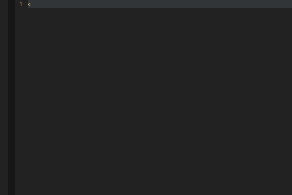
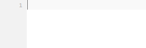
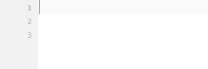
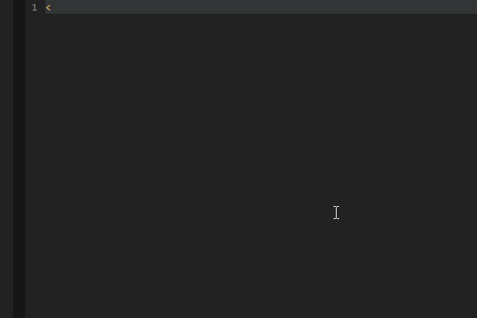
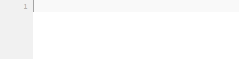

# PHP-Tags
PHP tag autocompletion

## Installation
 * Installing required snippets
 * Installing addon
 * Configure Short Tags (optional)

**Installing required snippets**  
For the autocompletion to work, you need to install snippets. 
You can adjust the snippets to needs (Indentation, etc.).  
The snippets can be found [here](https://github.com/babobski/PHP-Tags-Snippets).

## Autocompletions
This addon will provide auto completion for common php tags.  
Also is there support for short-tags, this can be ebabled trough the settings.

### PHP tag
```php
<?

// Will expand to
<?php [Tabstop] ?>
```


### echo tag
```php
<?

// Will expand to
<?php echo [Tabstop] ?>
```


### If tags
```php
<if

// Will expand to
<?php if([Tabstop]): ?>
	// [Tabstop]
<?php endif; ?>
```


### else tags
```php
<el

// Will expand to
<?php else: ?>
```


### If else tags
```php
<il

// Will expand to
<?php if([Tabstop]): ?>
	// [Tabstop]
<?php else: ?>
	// [Tabstop]
<?php endif; ?>
```


### Foreach tags
```php
<fo

// Will expand to
<?php foreach([Tabstop:$pages] as [Tabstop:$page]): ?>
	// [Tabstop]
<?php endforeach; ?>
```

