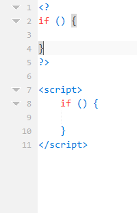
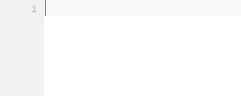

# Smart Tags Auto-completion
Get more done with less typing, emmet like auto completion for PHP and JavaScript.  
Quickly create if else statements, foreach loops and more.

## Installation
 * Install addon
 * Configure Short Tags (optional)

# Auto-completions
This addon will provide auto completion for common php tags.  
Also is there support for short-tags, this can be enabled trough the settings.

# Enabling and disabling tags  
In the prefernce menu you can enable and disable tags.  
This can be useful if you have a conflict wiath a html tag (like iframe conflicts with the <if if tag)

## PHP tag - <small>(php)</small>
To insert a default php tag, type `<?` and the following snippet will be inserted:

**<? will expand to:**

## echo tag - <small>(php)</small>
To instert a echo php tag, type `<ec` and the following snippet will be inserted:

**<ec will expand to:**

## If tag - <small>(php/js)</small>
To insert a if tag, type `<if` and the following snippet will be inserted:

**<if will expand to:**  
*PHP - sub-language: HTML*

*PHP - sub-language: PHP*  
*PHP - sub-language: JavaScript*  
*JavaScript - sub-language: JavaScript*

## else tag - <small>(php/js)</small>
To insert a else tag, type `<el` and the following snippet will be inserted:

**<el will expand to:**  
*PHP - sub-language: HTML*

*PHP - sub-language: PHP*  
*PHP - sub-language: JavaScript*  
*JavaScript - sub-language: JavaScript*

## else if tags - <small>(php/js)</small>
To insert a else tag, type `<ei` and the following snippet will be inserted:

**<ei will expand to:**  
*PHP - sub-language: HTML*

*PHP - sub-language: PHP*  
*PHP - sub-language: JavaScript*  
*JavaScript - sub-language: JavaScript*

## If else tag - <small>(php/js)</small>
To insert a if-else tag, type `<il` and the following snippet will be inserted:

**<il will expand to:**  
*PHP - sub-language: HTML*

*PHP - sub-language: PHP*  
*PHP - sub-language: JavaScript*  
*JavaScript - sub-language: JavaScript*  

## Foreach tag - <small>(php/js)</small>
To insert a foreach tag, type `<fo` and the following snippet will be inserted:

**<fo will expand to:**  
*PHP - sub-language: HTML*

*PHP - sub-language: PHP*

*PHP - sub-language: JavaScript*  
*JavaScript - sub-language: JavaScript*

## Switch tag - <small>(php/js)</small>
To insert a switch tag, type `<sw` and the following snippet will be inserted:

**<sw will expand to:**  
*PHP - sub-language: HTML*

*PHP - sub-language: PHP*  
*PHP - sub-language: JavaScript*  
*JavaScript - sub-language: JavaScript*

## Case tag - <small>(php/js)</small>
To insert a case tag, type `<ca` and the following snippet will be inserted:

**<ca will expand to:**  
*PHP - sub-language: HTML*

*PHP - sub-language: PHP*  
*PHP - sub-language: JavaScript*  
*JavaScript - sub-language: JavaScript*

## Print tag - <small>(php)</small>
To insert a print tag, type `<pr` and the following snippet will be inserted:

**<pr will expand to:**  
*PHP - sub-language: HTML*

# CheatSheet
In the right side pane you will find a cheat sheet so you can easily check witch abbreviations are available.

