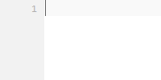

# Smart Tags Auto-completion
Get more done with less typing, emmet like auto completion for PHP and JavaScript.  
Quickly create if else statements, foreach loops and more.

## Installation
 * Installing required snippets
 * Installing addon
 * Configure Short Tags (optional)

**Installing required snippets**  
For the autocompletion to work, you need to install snippets.   
You can adjust the snippets to needs (Indentation, etc.).    
The snippets can be found [here](https://github.com/babobski/PHP-Tags-Snippets).

# Auto-completions
This addon will provide auto completion for common php tags.  
Also is there support for short-tags, this can be enabled trough the settings.

## PHP tag - <small>(php)</small>
To insert a default php tag, type `<?` and the following snippet will be inserted:

**<? will expand to:**



## echo tag - <small>(php)</small>
To instert a echo php tag, type `<ec` and the following snippet will be inserted:

**<ec will expand to:**


## If tag - <small>(php/js)</small>
To insert a if tag, type `<if` and the following snippet will be inserted:

**<if will expand to:**  
*PHP - sublanguage: HTML*


*PHP - sublanguage: PHP*  
*PHP - sublanguage: JavaScript*  
*JavaScript - sublanguage: JavaScript*


## else tag - <small>(php/js)</small>
To insert a else tag, type `<el` and the following snippet will be inserted:

**<el will expand to:**  
*PHP - sublanguage: HTML*


*PHP - sublanguage: PHP*  
*PHP - sublanguage: JavaScript*  
*JavaScript - sublanguage: JavaScript*


## else if tags - <small>(php/js)</small>
To insert a else tag, type `<ei` and the following snippet will be inserted:

**<ei will expand to:**  
*PHP - sublanguage: HTML*
```php
<? elseif([Tabstop]): ?>[Tabstop]

```
*PHP - sublanguage: PHP*  
*PHP - sublanguage: JavaScript*  
*JavaScript - sublanguage: JavaScript*
```php
 else if([Tabstop]) {
	[Tabstop]
}
```


## If else tag - <small>(php/js)</small>
To insert a if-else tag, type `<il` and the following snippet will be inserted:

**<il will expand to:**  
*PHP - sublanguage: HTML*
```php
<? if([Tabstop]): ?>
	[Tabstop]
<? else: ?>
	[Tabstop]
<? endif; ?>[Tabstop]
```
*PHP - sublanguage: PHP*  
*PHP - sublanguage: JavaScript*  
*JavaScript - sublanguage: JavaScript*  
```php
if ([Tabstop]) {
	[Tabstop]
} else {
	[Tabstop]	
}
```


## Foreach tag - <small>(php/js)</small>
To insert a foreach tag, type `<fo` and the following snippet will be inserted:

**<fo will expand to:**  
*PHP - sublanguage: HTML*
```php
<?php foreach([Tabstop:$pages] as [Tabstop:$page]): ?>
	[Tabstop]
<?php endforeach; ?>
```
*PHP - sublanguage: PHP*
```php
foreach ($[Tabstop:array] as $[Tabstop:item]) {
	[Tabstop]
}
```
*PHP - sublanguage: JavaScript*  
*JavaScript - sublanguage: JavaScript*
```php
for ([Tabstop:test]) {
	[Tabstop://code]
}
```


## Switch tag - <small>(php/js)</small>
To insert a switch tag, type `<sw` and the following snippet will be inserted:

**<sw will expand to:**  
*PHP - sublanguage: HTML*
```php
<?php switch([tabstop]:$value):
	case '[tabstop]': ?>
		[tabstop]
	<?php break; ?>
<?php endswitch; ?>
```
*PHP - sublanguage: PHP*  
*PHP - sublanguage: JavaScript*  
*JavaScript - sublanguage: JavaScript*
```php
switch ([Tabstop:expression]) {
	[Tabstop://case]
}
```


## Case tag - <small>(php/js)</small>
To insert a case tag, type `<ca` and the following snippet will be inserted:

**<ca will expand to:**  
*PHP - sublanguage: HTML*
```php
<?php case '[tabstop]': ?>
	[tabstop]
<?php break; ?>
```

*PHP - sublanguage: PHP*  
*PHP - sublanguage: JavaScript*  
*JavaScript - sublanguage: JavaScript*
```php
case '[tabstop]':
	[tabstop]
 break;
```


## Print tag - <small>(php)</small>
To insert a print tag, type `<pr` and the following snippet will be inserted:

**<pr will expand to:**  
*PHP - sublanguage: HTML*
```php
<?php echo '<pre>' . print_r([tabstop], true) . '</pre>'; ?>
```

