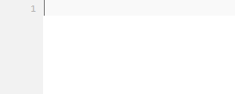

# Smart Tags Auto-completion
Get more done with less typing, the missing emmet like auto completion for PHP and JavaScript.  
Quickly create if else statements, foreach loops and more.

## Installation
 * Installing required snippets
 * Installing addon
 * Configure Short Tags (optional)

**Installing required snippets**  
For the autocompletion to work, you need to install snippets.   
You can adjust the snippets to needs (Indentation, etc.).    
The snippets can be found [here](https://github.com/babobski/PHP-Tags-Snippets).

## Auto-completions
This addon will provide auto completion for common php tags.  
Also is there support for short-tags, this can be enabled trough the settings.

### PHP tag - <small>(php)</small>
To insert a default php tag, type `<?` and the following snippet will be inserted:

```php
// <? WILL EXPAND TO:
<?php [Tabstop] ?>
```


### echo tag - <small>(php)</small>
To instert a echo php tag, type `<ec` and the following snippet will be inserted:
```php
// <ec WILL EXPAND TO:
<?php echo [Tabstop] ?>
```


### If tag - <small>(php/js)</small>
To insert a if tag, type `<if` and the following snippet will be inserted:
```php
// <if WILL EXPAND TO:
// PHP - sublanguage: HTML
<?php if([Tabstop]): ?>
	[Tabstop]
<?php endif; ?>

// PHP - sublanguage: PHP
if ([Tabstop]) {
	[Tabstop]
}

// PHP - sublanguage: JavaScript
// JavaScript - sublanguage: JavaScript
if ([Tabstop]) {
	[Tabstop]
}
```


### else tag - <small>(php/js)</small>
To insert a else tag, type `<el` and the following snippet will be inserted:
```php
// <el WILL EXPAND TO:
// PHP - sublanguage: HTML
<?php else: ?>

// PHP - sublanguage: PHP
 else {
	[Tabstop]
}

// PHP - sublanguage: JavaScript
// JavaScript - sublanguage: JavaScript
 else {
	[Tabstop]
}

```


### else if tags - <small>(php/js)</small>
To insert a else tag, type `<el` and the following snippet will be inserted:
```php
// <ei WILL EXPAND TO:
// PHP - sublanguage: HTML
<? elseif([Tabstop]): ?>[Tabstop]

```

### If else tag - <small>(php/js)</small>
To insert a if-else tag, type `<il` and the following snippet will be inserted:
```php
// <il Will expand to
<?php if([Tabstop]): ?>
	// [Tabstop]
<?php else: ?>
	// [Tabstop]
<?php endif; ?>
```



### Foreach tag - <small>(php/js)</small>
To insert a foreach tag, type `<fo` and the following snippet will be inserted:
```php
// <fo Will expand to
<?php foreach([Tabstop:$pages] as [Tabstop:$page]): ?>
	// [Tabstop]
<?php endforeach; ?>
```


### Switch tag - <small>(php/js)</small>
To insert a switch tag, type `<sw` and the following snippet will be inserted:
```php
// <sw Will expand to
<?php switch([tabstop]:$value):
	case '[tabstop]': ?>
		// [tabstop]
	<?php break; ?>
<?php endswitch; ?>
```


### Case tag - <small>(php/js)</small>
To insert a case tag, type `<ca` and the following snippet will be inserted:
```php
// <ca Will expand to:
// PHP - sublanguage: HTML
<?php case '[tabstop]': ?>
	[tabstop]
<?php break; ?>

// PHP - sublanguage: PHP
case '[tabstop]':
	[tabstop]
break;

// PHP - sublanguage: JavaScript
// JavaScript - sublanguage: JavaScript
case '[tabstop]':
	[tabstop]
break;
```


### Print tag - <small>(php)</small>
To insert a print tag, type `<pr` and the following snippet will be inserted:
```php
// <pr Will expand to
<?php echo '<pre>' . print_r([tabstop], true) . '</pre>'; ?>
```

